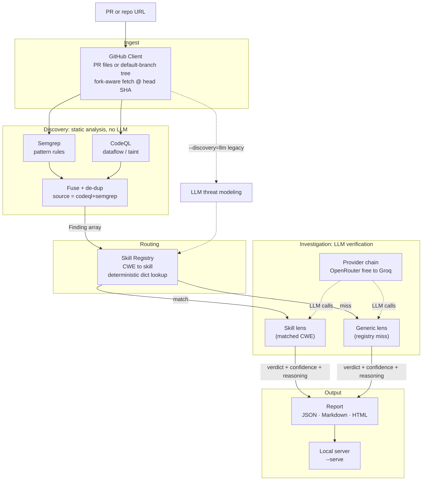
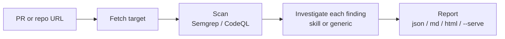

# ThreatLens

ThreatLens is a PR and repo vulnerability triage agent (v2). It uses scanners to
find candidates, then an LLM to check whether each one is real.

Point it at a GitHub pull request URL, or at a bare repo URL. It will:

1. **Discover** with static analysis. It scans the PR's changed files, or the
   repo's default branch, and emits CWE tagged findings. No LLM and no API key
   for this step.
   * **Semgrep** (default): pattern rules. Broad and fast.
   * **CodeQL** (`--discovery codeql`): dataflow and taint analysis.
   * **Both** (`--discovery both`): runs Semgrep and CodeQL together, fuses
     results, and marks agreement as `codeql+semgrep`.
2. **Investigate** with an LLM. For each finding it applies a matched CWE skill
   (or a generic fallback), traces source to sink, and returns TRUE_POSITIVE or
   FALSE_POSITIVE with confidence and a short reasoning chain. That is the
   false positive filter.

Legacy v1 LLM discovery is still available with `--discovery=llm` if you want to
compare. This is a portfolio and interview demo project with its own skill
schema, output schema, and confidence rubric.

## Architecture

Two layers, clear split of work: cheap static analysis finds candidates; the LLM
only verifies them.



Discovery is static analysis only. Semgrep is the default (pattern rules).
CodeQL adds dataflow and taint via `security-extended` suites. With
`--discovery=both`, results are fused and de duplicated; findings both tools
agree on are marked `codeql+semgrep` (treat that as higher confidence).

Routing from finding to skill is a plain dict lookup. No LLM picks the skill.
Only the per finding investigation calls the model, which keeps cost and
latency down and keeps the pipeline auditable. Every finding still gets a
verdict: a registry miss falls back to the generic lens (`skill_used="generic"`)
instead of being dropped.

## Workflow



If the scan finds nothing, the run stops there and spends zero LLM tokens. Each
finding is investigated on its own, so one failure does not sink the whole run.

## Confidence heuristic

Stage 2 returns a confidence score from 1 to 10 with each verdict. The prompt
calibrates that score to how much of the source to sink path is actually visible
in the code you gave the model:

| Score | Meaning |
|-------|---------|
| 9 to 10 | Complete source to sink trace visible in the provided code |
| 6 to 8 | Strong indication; one hop assumed or only partially visible |
| 3 to 5 | Plausible, but a key link is unverified in the provided context |
| 1 to 2 | Mostly speculation |

When context is too thin to confirm reachability, the model should lean
FALSE_POSITIVE and lower confidence rather than guess. False alarms are the
problem ThreatLens is trying to shrink.

## Interview explanation

**One liner.** ThreatLens triages a GitHub PR for vulnerabilities by pairing a
deterministic static analysis discovery layer with an LLM verification layer, so
every candidate finding gets an auditable true or false positive verdict with a
source to sink reasoning chain.

**The thesis.** Semgrep and CodeQL are good at finding candidate sinks, but they
are noisy. In real security work, the hard part is triaging those false
positives. LLMs are good at reading code in context, but they hallucinate if you
ask them to hunt for bugs open ended. So the job splits along that seam:

* **Discovery uses tools.** Deterministic, fast, free, reproducible, and
  complete. A clean PR costs zero LLM tokens. CodeQL brings dataflow and taint;
  Semgrep brings broad pattern coverage; fusing them lets agreement act as a
  confidence signal.
* **Verification uses the LLM.** The model is never asked "is there a bug here?"
  in the abstract. It gets a specific finding plus the code, and a narrow
  checkable question: can attacker controlled input actually reach this sink
  without an adequate control? That is the question LLMs handle well.

**Why this design.** It flips the naive "ask the LLM to find vulnerabilities"
approach. The LLM does contextual reasoning over a bounded question. The tools
do exhaustive, deterministic enumeration. Cost stays low, runs stay auditable,
and the metric that matters in practice (false positive rate) is front and
center.

**Design choices worth defending**

* **Deterministic routing, not an agent that picks tools.** CWE to skill is a
  plain dict lookup. No LLM decides control flow, so runs are reproducible and
  cheap.
* **Principle based skills.** Each skill in `skills/*.yaml` encodes the security
  principle (source definition, sink definition, mitigation patterns, a source
  to sink checklist) rather than framework specific API names, so it travels
  across languages. Concrete APIs show up only as illustrative hints.
* **No finding is ever dropped.** A CWE with no matching skill falls back to a
  generic lens (`skill_used="generic"`), covered by a test, so coverage does not
  silently regress when a new rule fires.
* **Confidence tied to evidence, not vibes.** The 1 to 10 score tracks how much
  of the source to sink path is visible in the provided code. When reachability
  cannot be confirmed, the prompt tells the model to lean FALSE_POSITIVE and
  lower confidence.
* **Swappable, free LLMs.** Providers live in `providers.yaml` with an
  OpenRouter to Groq fallback chain, so one model dying or rate limiting does
  not break a run.
* **Structured, typed output end to end.** Pydantic models (`Finding`,
  `InvestigationResult`, and friends) mean the report, the HTML view, and the
  eval harness all share one schema.

**How I validate it.** There is a labeled corpus under `eval/` and harnesses that
score end to end verdict accuracy and compare skill based vs generic
investigation. Claims about accuracy are measured. Real bugs I hit and fixed
live in `docs/journal.md` (for example fork PRs needing head SHA fetch before
Semgrep could see files, and a line offset between CodeQL and Semgrep breaking
exact line fusion).

**Honest limits and next steps.** LLM verification is still non deterministic at
the margins (the evidence based confidence rubric helps). Coverage is bounded by
the discovery tools' rules and by CodeQL's no build language support.
Per finding cost is aggregate, not itemized. Natural next steps include multi
repo scanning, more skills and rulesets, and caching verdicts per finding hash
and model.

**60 second version.** "It is a PR security triage agent. Static analysis finds
the candidates. The LLM's only job is to confirm reachability on each one and
give a verdict with a reasoning chain. I split it that way because tools are
noisy but complete, and LLMs are smart but hallucinate, so each side does the
half it is good at. Routing is deterministic, every finding gets a verdict, and
I measure accuracy against a labeled set."

## Setup

```bash
python -m venv .venv
.venv\Scripts\activate          # Windows
# source .venv/bin/activate     # macOS / Linux
pip install -e ".[dev]"
copy .env.example .env          # then fill in keys
```

**Discovery engines** (both free; no LLM API key for scanning):

* **Semgrep** (default). The runner picks a backend automatically.
  * Linux / macOS / WSL: `pip install semgrep` (local binary on PATH).
  * Windows: Semgrep has no native binary. **Docker Desktop must be running**
    for default or `both` scans. The runner uses the official
    `semgrep/semgrep` image (`docker pull semgrep/semgrep`).
* **CodeQL** (optional, for `--discovery codeql` or `both`). One time bundle
  setup; does not need Docker:
  ```bash
  python scripts/setup_codeql.py        # downloads + extracts ~670 MB into .codeql/
  ```
  Or point `THREATLENS_CODEQL` at an existing `codeql` binary. Only no build
  languages are analyzed (Python, JavaScript/TypeScript, Ruby).

Required env vars (see `.env.example`):

| Variable | Purpose |
|---|---|
| `GITHUB_TOKEN` | Read only GitHub PAT (higher rate limits) |
| `OPENROUTER_API_KEY` | Primary free model chain |
| `GROQ_API_KEY` | Secondary fallback |

Provider order is config driven via `providers.yaml`. You can swap models without
touching code.

## Run your first scan (step by step)

You only need a PR link or a repo link. Do the setup once, then reuse the same
commands for any target.

1. **Install ThreatLens** from the project folder:
   ```bash
   python -m venv .venv
   .venv\Scripts\activate          # Windows
   # source .venv/bin/activate     # macOS / Linux
   pip install -e ".[dev]"
   ```
2. **Add API keys.** Copy `.env.example` to `.env` and paste:
   * `GITHUB_TOKEN`: a [GitHub personal access token](https://github.com/settings/tokens) (read only is enough)
   * `OPENROUTER_API_KEY` and/or `GROQ_API_KEY`: free LLM keys for investigation
3. **Semgrep backend.** On Windows, start **Docker Desktop** before any scan that
   uses Semgrep (default or `--discovery both`). On macOS or Linux, install
   Semgrep with pip instead (no Docker). CodeQL only scans
   (`--discovery codeql`) do not need Docker.
4. **(Optional) Install CodeQL** if you want `--discovery codeql` or `both`:
   ```bash
   python scripts/setup_codeql.py
   ```
5. **Run a scan.** Pick one:

   **A. Default: Semgrep discovery + LLM, open the report in your browser**
   ```bash
   threatlens pr analyze https://github.com/juice-shop/juice-shop/pull/655 --serve
   ```

   **B. CodeQL only discovery + LLM**
   ```bash
   threatlens pr analyze https://github.com/juice-shop/juice-shop/pull/655 --discovery codeql --serve
   ```

   **C. Strongest discovery: Semgrep + CodeQL fused + LLM**
   ```bash
   threatlens pr analyze https://github.com/juice-shop/juice-shop/pull/655 --discovery both --serve
   ```

   **D. Scan a whole repo's default branch** (no PR number needed)
   ```bash
   threatlens pr analyze https://github.com/vulnerable-apps/damn-vulnerable-MCP-server --serve
   ```

6. **Read the report.** The terminal prints findings. With `--serve`, your
   browser opens `http://127.0.0.1:8000/`. Click a finding for the full write up
   (location, reasoning trace, verdict). Stop the server with `Ctrl+C` in the
   terminal.

**What each flag means**

| Flag | Plain English |
|------|----------------|
| *(none)* / `--discovery semgrep` | Semgrep finds candidates; LLM says true or false positive |
| `--discovery codeql` | CodeQL dataflow/taint only (no Docker) |
| `--discovery both` | Semgrep and CodeQL; agreement is marked higher confidence |
| `--serve` | Host the HTML report locally and open it in the browser |
| `--stage1-only` | Scan only; skip LLM investigation (faster, no verdicts) |
| `--pr 3` | When you pass a repo URL, analyze PR `#3` instead of the default branch |

Tip: first runs can take a few minutes (Docker image pull, CodeQL download, LLM
calls). Later runs on the same machine are faster.

## Usage

```bash
# Default: Semgrep discovery + per-finding LLM investigation
threatlens pr analyze https://github.com/<owner>/<repo>/pull/<n>

# Same, and open the interactive HTML report in the browser
threatlens pr analyze https://github.com/<owner>/<repo>/pull/<n> --serve

# Bare repo URL: scan default-branch code (not auto-latest-PR)
threatlens pr analyze https://github.com/<owner>/<repo>
threatlens pr analyze <owner>/<repo>

# Pin a PR on that repo (PR-scoped changed-files scan)
threatlens pr analyze https://github.com/<owner>/<repo> --pr 3
threatlens pr analyze https://github.com/<owner>/<repo>/pull/3

# CodeQL discovery (dataflow/taint), or Semgrep + CodeQL fused
threatlens pr analyze <PR_URL> --discovery codeql
threatlens pr analyze <PR_URL> --discovery both

# Legacy v1 LLM discovery (for comparison)
threatlens pr analyze <PR_URL> --discovery llm

# Discovery only (no investigation)
threatlens pr analyze <PR_URL> --stage1-only

# Ignore skills; investigate everything with the generic lens
threatlens pr analyze <PR_URL> --force-generic

# Save the report (json | md | html) and/or pin a model
threatlens pr analyze <PR_URL> --output report.md --format md
threatlens pr analyze <PR_URL> --output report.html --format html
threatlens pr analyze <PR_URL> --model openai/gpt-oss-20b:free
```

When you pass a PR URL or `--pr`, ThreatLens focuses on that PR's changed files.
A bare repo link scans the default branch (scannable source files, capped) so
vulnerable demo repos work without hunting for a PR number.

The `html` format is a self contained report with no extra dependencies. Open it
in a browser and expand any finding to watch its source to sink to verdict
trace. Re render any saved report JSON with
`python scripts/render_report.py report.json report.html`.

Or host the report live instead of writing a file:

```bash
# analyze and serve the HTML report on a local port (auto-opens the browser)
threatlens pr analyze <PR_URL> --serve            # http://127.0.0.1:8000/
threatlens pr analyze <PR_URL> --serve --port 8080 --no-browser

# host a previously saved report JSON with no file written
threatlens report serve report.json
```

Discovery (Semgrep and/or CodeQL) surfaces CWE tagged findings in the PR's
changed files or the repo default branch. Each finding is then traced by the LLM
(matched skill or generic fallback) and ruled TRUE_POSITIVE or FALSE_POSITIVE
with a confidence score and reasoning chain.

## Skills (principle based)

CWE specific skills live in `skills/*.yaml` (injection, auth, SSRF,
deserialization). Each one is written around the underlying security principle,
not specific APIs, so it generalizes across languages and frameworks. A skill
declares the CWEs it covers, a reachability definition, source and sink
definitions, mitigation patterns, and a source to sink checklist. Concrete APIs
appear only as illustrative ecosystem hints. Routing from a finding's CWE to a
skill is a deterministic dict lookup; a miss uses the generic lens
(`prompts/investigate_generic.md`). Add a skill by dropping in a new YAML file.

## Eval / tuning

```bash
python scripts/run_stage1_eval.py       # scores legacy Stage 1 vs eval/corpus.yaml
python scripts/run_verdict_eval.py      # end-to-end verdict accuracy (Semgrep) vs eval/verdicts.yaml
python scripts/run_skill_vs_generic.py  # skill-vs-generic accuracy comparison
```

## Project layout

```
src/threatlens/
  github_client.py      # PR fetch + default-branch repo scan; fork-aware head fetch
  models.py             # Finding, Threat, ThreatModel, InvestigationResult, Skill
  discovery/            # semgrep_scan + codeql_scan + fuse -> Finding[]
  providers/            # OpenRouter + Groq + fallback chain
  stages/               # investigation (+ legacy LLM threat modeling)
  skills/registry.py    # deterministic CWE -> skill lookup (generic fallback)
  pipeline.py           # discovery -> investigation orchestration
  cli.py
prompts/                # generic fallback investigation prompt
scripts/                # eval harnesses + setup_codeql.py
docs/                   # PRD, design, plan, journal
skills/                 # principle-based CWE skill YAML files
eval/                   # tuning corpus, verdict labels, run outputs
```

## Tests

```bash
pytest
```

## Docs

* [PRD](docs/prd.md)
* [Design](docs/design.md)
* [Plan](docs/plan.md)
* [Build journal](docs/journal.md)
