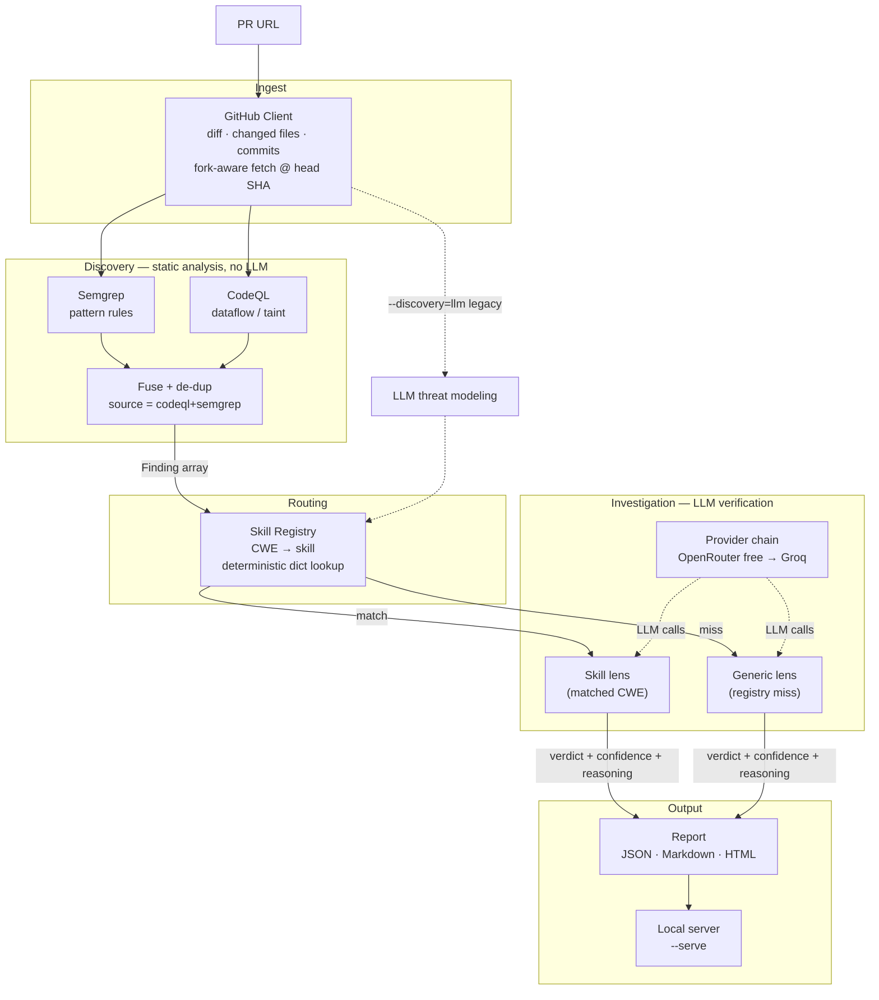
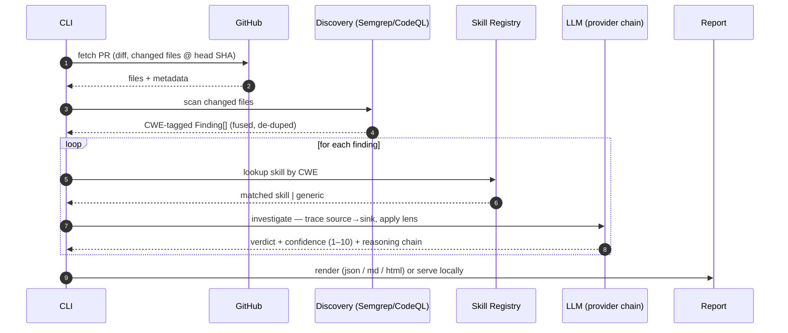

# ThreatLens

PR vulnerability triage agent (**v2 — scanner-driven discovery + LLM verification**).
Given a GitHub PR URL, ThreatLens:

1. **Discovery — Semgrep:** a static analyzer scans the PR's changed files and
   emits CWE-tagged findings. Deterministic, broad, free, no API key.
2. **Investigation — LLM:** for each finding, apply the matched CWE skill (or a
   generic fallback) and trace source→sink to produce a TRUE_POSITIVE /
   FALSE_POSITIVE verdict with confidence and a reasoning chain. This is the
   false-positive-elimination layer.

The v1 LLM-based discovery remains available via `--discovery=llm` for comparison.
Built as a portfolio/demo project for AI Security Engineer interviews — original
skill schema, output schema, and confidence heuristic.

## Architecture

Two layers with a clear division of labor: **cheap, deterministic static analysis
finds candidates; the LLM only verifies them.**



Discovery is static analysis (no LLM): **Semgrep** (pattern rules, default) and/or
**CodeQL** (dataflow/taint via `security-extended` suites); `--discovery=both`
fuses and de-duplicates them (findings agreed on by both tools are marked
`codeql+semgrep` = higher confidence). Routing from finding to skill is a
deterministic dict lookup (no LLM). Only the per-finding investigation calls the
LLM — which keeps cost/latency down and makes the pipeline auditable. **Every
finding gets a verdict:** a registry miss falls back to the generic lens
(`skill_used="generic"`) rather than being dropped.

## Workflow

End-to-end runtime flow of a single `threatlens pr analyze` invocation:



If discovery yields nothing, the pipeline stops before any LLM call — a clean PR
costs zero tokens. The loop is per-finding and independent, so a single failed or
rate-limited investigation is recorded in `errors` without sinking the whole run.

## Confidence heuristic

Stage 2 returns a 1–10 confidence with each verdict, calibrated in the
investigation prompt to how much of the source→sink path is actually visible:

| Score | Meaning |
|-------|---------|
| 9–10 | Complete source-to-sink trace visible in the provided code |
| 6–8 | Strong indication; one hop assumed or only partially visible |
| 3–5 | Plausible, but a key link is unverified in the provided context |
| 1–2 | Mostly speculation |

When context is insufficient to confirm reachability, the model is instructed to
lean FALSE_POSITIVE and lower confidence rather than guess — false alarms are the
exact problem ThreatLens exists to reduce.

## Interview explanation

**One-liner.** ThreatLens triages a GitHub PR for vulnerabilities by pairing a
deterministic static-analysis *discovery* layer with an LLM *verification* layer,
so every candidate finding gets an auditable TRUE/FALSE-positive verdict with a
source→sink reasoning chain.

**The thesis.** Static analyzers (Semgrep, CodeQL) are good at *finding* candidate
sinks but notoriously noisy — the pain in real security work is triaging their
false positives. LLMs are good at *reading code in context* but hallucinate if you
ask them to hunt for bugs open-endedly. So I split the job along that seam:

- **Discovery = tools.** Deterministic, fast, free, reproducible, and complete
  (a clean PR provably costs zero LLM tokens). CodeQL adds real dataflow/taint
  tracking; Semgrep adds broad pattern coverage; fusing them lets agreement act as
  a confidence signal.
- **Verification = LLM.** The model is never asked "is there a bug here?" in the
  abstract. It's handed a *specific* finding plus the code and asked the narrow,
  checkable question: *can attacker-controlled input actually reach this sink
  without an adequate control?* That's the question LLMs are actually good at.

**Why this is the interesting design decision.** It inverts the naive "ask the LLM
to find vulnerabilities" approach. The LLM does the part it's reliable at
(contextual reasoning over a bounded question) and the tools do the part they're
reliable at (exhaustive, deterministic enumeration). This keeps cost low, keeps the
system auditable, and directly targets the metric that matters in practice —
false-positive rate.

**Design decisions worth defending:**

- **Deterministic routing, not an agent that picks tools.** CWE → skill is a plain
  dict lookup. No LLM decides control flow, so runs are reproducible and cheap.
- **Principle-based skills.** Each skill (`skills/*.yaml`) encodes the *security
  principle* (source definition, sink definition, mitigation patterns, a
  source→sink checklist) rather than framework-specific API names, so it
  generalizes across languages. Concrete APIs appear only as illustrative hints.
- **No finding is ever dropped.** A CWE with no matching skill falls back to a
  generic lens (`skill_used="generic"`) — verified by a test — so coverage never
  silently regresses when a new rule fires.
- **Confidence tied to evidence, not vibes.** The 1–10 score is calibrated to how
  much of the source→sink path is *visible in the provided code*; when reachability
  can't be confirmed, the prompt tells the model to lean FALSE_POSITIVE and lower
  confidence rather than guess.
- **Swappable, free LLMs.** Providers are config-driven (`providers.yaml`) with an
  OpenRouter→Groq fallback chain, so a model going away or rate-limiting doesn't
  break a run.
- **Structured, typed output end-to-end.** Pydantic models (`Finding`,
  `InvestigationResult`, …) mean the report, the HTML view, and the eval harness
  all consume the same schema — no stringly-typed glue.

**How I validate it.** There's a labeled corpus (`eval/`) and harnesses that score
end-to-end verdict accuracy and compare skill-based vs generic investigation, so
claims about accuracy are measured, not asserted. Real bugs I hit and fixed are in
`docs/journal.md` (e.g. fork PRs needing head-SHA fetch before Semgrep could see
files; a line-offset between CodeQL and Semgrep breaking exact-line fusion).

**Honest limitations / next steps.** LLM verification is non-deterministic at the
margins (mitigated by the evidence-based confidence rubric); coverage is bounded by
the discovery tools' rules and CodeQL's no-build language support; and per-finding
cost is aggregate, not itemized. Natural extensions: multi-repo scanning, more
skills/rulesets, and caching verdicts per (finding-hash, model).

**60-second version.** "It's a PR security triage agent. Static analysis finds the
candidates; the LLM's only job is to confirm reachability on each one and give a
verdict with a reasoning chain. I split it that way because tools are noisy but
complete, and LLMs are smart but hallucinate — so I let each do the half it's good
at. Routing is deterministic, every finding gets a verdict, and I measure accuracy
against a labeled set."

## Setup

```bash
python -m venv .venv
.venv\Scripts\activate          # Windows
pip install -e ".[dev]"
copy .env.example .env          # then fill in keys
```

**Discovery engines** (both free, no API key):

- **Semgrep** — the runner auto-detects a backend:
  - *Linux / macOS / WSL:* `pip install semgrep` (local binary on PATH).
  - *Windows:* Semgrep has no native binary; install **Docker Desktop** and the
    runner uses the official `semgrep/semgrep` image automatically
    (`docker pull semgrep/semgrep`).
- **CodeQL** (optional, for `--discovery=codeql|both`) — one-time bundle setup:
  ```bash
  python scripts/setup_codeql.py        # downloads + extracts ~670 MB into .codeql/
  ```
  Or point `THREATLENS_CODEQL` at an existing `codeql` binary. Only no-build
  languages are analyzed (Python, JavaScript/TypeScript, Ruby).

Required env vars (see `.env.example`):

| Variable | Purpose |
|---|---|
| `GITHUB_TOKEN` | Read-only GitHub PAT (higher rate limits) |
| `OPENROUTER_API_KEY` | Primary free-model chain |
| `GROQ_API_KEY` | Secondary fallback |

Provider order is config-driven via `providers.yaml` — swap models without code changes.

## Usage

```bash
# Default: Semgrep discovery + per-finding LLM investigation
threatlens pr analyze https://github.com/<owner>/<repo>/pull/<n>

# CodeQL discovery (dataflow/taint), or Semgrep + CodeQL fused
threatlens pr analyze <PR_URL> --discovery codeql
threatlens pr analyze <PR_URL> --discovery both

# Legacy v1 LLM discovery (for comparison)
threatlens pr analyze <PR_URL> --discovery llm

# Discovery only (no investigation)
threatlens pr analyze <PR_URL> --stage1-only

# Ignore skills; investigate everything with the generic lens
threatlens pr analyze <PR_URL> --force-generic

# Save the report (json | md | html) and/or pin a model
threatlens pr analyze <PR_URL> --output report.md --format md
threatlens pr analyze <PR_URL> --output report.html --format html
threatlens pr analyze <PR_URL> --model openai/gpt-oss-20b:free
```

The `html` format is a self-contained, dependency-free report: open it in a
browser, and expand any finding to watch its source→sink→verdict trace reveal
step by step. Re-render any saved report JSON with
`python scripts/render_report.py report.json report.html`.

Or host the report live instead of writing a file:

```bash
# analyze and serve the HTML report on a local port (auto-opens the browser)
threatlens pr analyze <PR_URL> --serve            # http://127.0.0.1:8000/
threatlens pr analyze <PR_URL> --serve --port 8080 --no-browser

# host a previously saved report JSON with no file written
threatlens report serve report.json
```

Semgrep surfaces CWE-tagged findings in the PR's changed files; each finding is
then traced by the LLM (matched skill or generic fallback) and ruled
TRUE_POSITIVE / FALSE_POSITIVE with a confidence score and reasoning chain.

## Skills (principle-based)

CWE-specific skills live in `skills/*.yaml` (injection, auth, SSRF, deserialization).
Each is written around the underlying **security principle**, not specific APIs, so
it generalizes across languages/frameworks. A skill declares the CWEs it covers, a
`reachability` definition, `source_definition` / `sink_definition`,
`mitigation_patterns`, and a source→sink `checklist`; concrete APIs appear only as
illustrative `mitigation_examples_by_ecosystem` hints. Routing from a finding's CWE
to a skill is a deterministic dict lookup; a miss uses the generic lens
(`prompts/investigate_generic.md`). Add a skill by dropping in a new YAML file.

## Eval / tuning

```bash
python scripts/run_stage1_eval.py       # scores legacy Stage 1 vs eval/corpus.yaml
python scripts/run_verdict_eval.py      # end-to-end verdict accuracy (Semgrep) vs eval/verdicts.yaml
python scripts/run_skill_vs_generic.py  # skill-vs-generic accuracy comparison
```

## Project layout

```
src/threatlens/
  github_client.py      # PR fetch (diff, files, commits); fork-aware head fetch
  models.py             # Finding, Threat, ThreatModel, InvestigationResult, Skill
  discovery/            # semgrep_scan + codeql_scan + fuse -> Finding[]
  providers/            # OpenRouter + Groq + fallback chain
  stages/               # investigation (+ legacy LLM threat modeling)
  skills/registry.py    # deterministic CWE -> skill lookup (generic fallback)
  pipeline.py           # discovery -> investigation orchestration
  cli.py
prompts/                # generic fallback investigation prompt
scripts/                # eval harnesses + setup_codeql.py
docs/                   # PRD, design, plan, journal
skills/                 # principle-based CWE skill YAML files
eval/                   # tuning corpus, verdict labels, run outputs
```

## Tests

```bash
pytest
```

## Docs

- [PRD](docs/prd.md)
- [Design](docs/design.md)
- [Plan](docs/plan.md)
- [Build journal](docs/journal.md)
