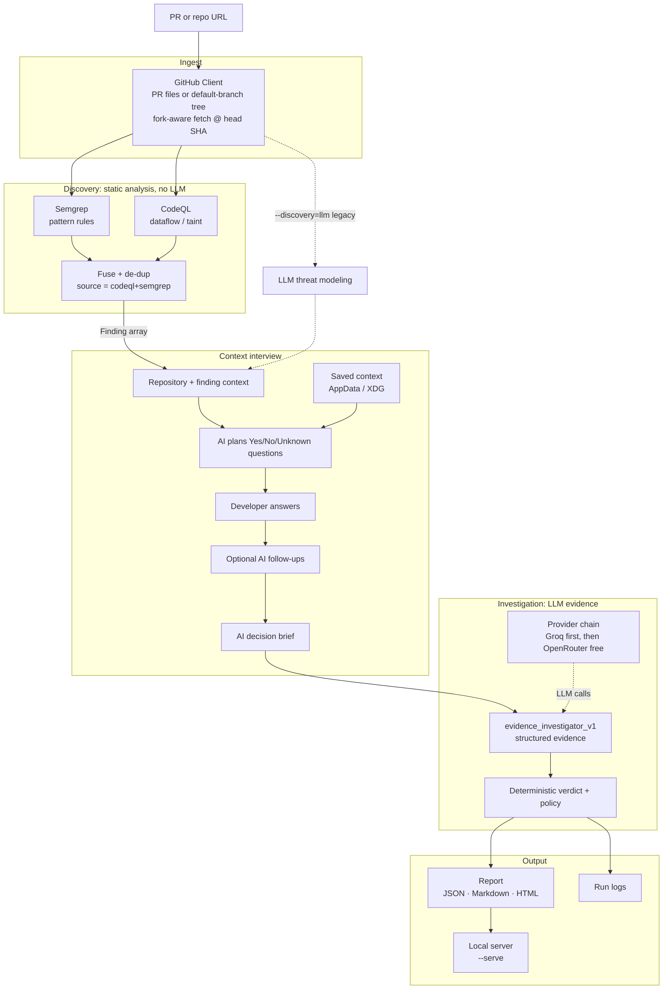
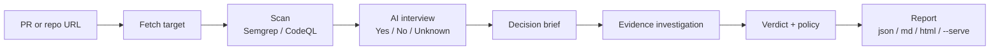

# ThreatLens

ThreatLens is a PR and repo vulnerability triage agent. Scanners find candidate
issues. An LLM checks whether each one is actually exploitable. You get a
structured evidence trail, a technical verdict, and a separate merge
recommendation.

Point it at a GitHub pull request URL, or at a bare repo URL. It will:

1. **Discover** with static analysis. It scans the PR's changed files, or the
   repo's default branch, and emits CWE tagged findings. No LLM and no API key
   for this step.
   * **Semgrep** (default): pattern rules. Broad and fast.
   * **CodeQL** (`--discovery codeql`): dataflow and taint analysis.
   * **Both** (`--discovery both`): runs Semgrep and CodeQL together, fuses
     results, and marks agreement as `codeql+semgrep`.
2. **Interview** (interactive runs). ThreatLens asks Yes / No / Unknown
   questions like a security engineer talking to a developer. An AI layer plans
   and may follow up. Every scan is treated as a real production system. It
   never asks whether the repo is a demo or lab app.
3. **Investigate** with one evidence investigator (`evidence_investigator_v1`).
   The LLM returns structured evidence. Code derives the verdict
   (`confirmed` / `likely` / `not_exploitable` / `insufficient_context`) and a
   separate merge action (`pass` / `warn` / `require_review` / `block`).

Legacy v1 LLM discovery is still available with `--discovery=llm` if you want to
compare.

## Architecture

Cheap static analysis finds candidates. The LLM only verifies them. Context
answers stay Yes / No / Unknown. Smarter judgment happens in a short AI decision
brief before investigation.



Discovery is static analysis only. Semgrep is the default. CodeQL adds dataflow
and taint via `security-extended` suites. With `--discovery=both`, results are
fused and de duplicated. Findings both tools agree on are marked
`codeql+semgrep` (treat that as higher confidence).

Every finding is investigated. The LLM returns structured evidence. Verdicts and
merge policy are derived in code. Missing evidence stays unknown. It is never
treated as proof of safety.

## Workflow



If the scan finds nothing, the run stops and spends zero LLM tokens on
investigation. Each finding is investigated on its own, so one failure does not
sink the whole run.

## Security interview

Interactive runs open a short security interview before investigation.

* Answers are only **Yes**, **No**, or **Unknown**.
* An AI layer plans the questions from the findings, can rewrite them in plain
  language, and may ask a few follow ups after your answers.
* Questions stay operational: reachability, auth, sensitive data, production
  enablement, edge controls, family specific controls (SSRF proxy, injection
  privilege, live secrets, and so on), and merge policy.
* Every target is treated as **production**. ThreatLens will not ask if the repo
  is a demo, CTF, or intentionally vulnerable lab.
* Answers are saved per repository so the next run can skip what you already
  answered. Use `--refresh-context` to ask again. Use `threatlens context clear`
  to wipe saved answers.
* Use `--non-interactive` in CI. That skips prompts and keeps unknowns.

After the interview, an AI decision brief turns those Yes / No / Unknown answers
into investigation guidance (exposure level, priorities, assumptions). The
investigator must still verify claims in code.

## Confidence heuristic

Investigation returns a confidence score from 1 to 10. The prompt calibrates that
score to how much of the source to sink path is visible in the code you gave the
model:

| Score | Meaning |
|-------|---------|
| 9 to 10 | Complete source to sink trace visible in the provided code |
| 6 to 8 | Strong indication; one hop assumed or only partially visible |
| 3 to 5 | Plausible, but a key link is unverified in the provided context |
| 1 to 2 | Mostly speculation |

When context is too thin, evidence statuses stay `unknown` and the derived
verdict is `insufficient_context` or `likely`. Never a silent pass. Absence of
evidence is not evidence of safety.

## Interview explanation

**One liner.** ThreatLens triages a GitHub PR or repo for vulnerabilities by
pairing static analysis discovery with LLM verification, so every candidate gets
structured evidence, a derived exploitability verdict, and a separate merge
recommendation.

**The thesis.** Semgrep and CodeQL are good at finding candidate sinks, but they
are noisy. In real security work, the hard part is triaging false positives.
LLMs are good at reading code in context, but they hallucinate if you ask them
to hunt for bugs open ended. So the job splits along that seam:

* **Discovery uses tools.** Deterministic, fast, free, reproducible, and
  complete. A clean PR costs zero LLM tokens.
* **Context uses a short interview.** Humans answer Yes / No / Unknown. AI
  plans the questions and synthesizes a decision brief. Production assumption
  is fixed.
* **Verification uses the LLM.** The model is never asked "is there a bug
  here?" in the abstract. It gets a specific finding plus the code, and a
  narrow checkable question: can attacker controlled input actually reach this
  sink without an adequate control?

**Design choices worth defending**

* **One evidence investigator for every finding.** No CWE to skill router.
  Optional CWE hints are non authoritative supplements only.
* **LLM returns evidence; code derives verdicts.** Merge policy is separate from
  technical exploitability.
* **No finding is ever dropped.** Cap on repo file fetch still applies for
  GitHub limits, but every discovered finding in scope is investigated.
* **Unknown stays unknown.** Missing deployment facts produce
  `insufficient_context` / review recommendations, not false positive dismissals.
* **Smart free LLM priority.** Groq first for quality, then OpenRouter free
  models for capacity, with retries and backoff on rate limits.
* **Safe local report hosting.** `--serve` fails if the port is busy (unless you
  pass `--allow-port-fallback`), auto saves a report snapshot, and shows a run
  id in the HTML so you do not confuse an old server with a new run.
* **Structured, typed output end to end.** Pydantic models mean the report, the
  HTML view, and the eval harness share one schema.

**60 second version.** "It is a PR security triage agent. Static analysis finds
the candidates. A short Yes / No / Unknown interview gathers production context.
The LLM confirms reachability on each finding and returns evidence. Code derives
the verdict and merge action. Tools are noisy but complete. LLMs are smart but
hallucinate. Each side does the half it is good at."

## Setup

```bash
python -m venv .venv
.venv\Scripts\activate          # Windows
# source .venv/bin/activate     # macOS / Linux
pip install -e ".[dev]"
copy .env.example .env          # then fill in keys
```

**Discovery engines** (both free; no LLM API key for scanning):

* **Semgrep** (default). The runner picks a backend automatically.
  * Linux / macOS / WSL: `pip install semgrep` (local binary on PATH).
  * Windows: Semgrep has no native binary. **Docker Desktop must be running**
    for default or `both` scans. The runner uses the official
    `semgrep/semgrep` image (`docker pull semgrep/semgrep`).
* **CodeQL** (optional, for `--discovery codeql` or `both`). One time bundle
  setup; does not need Docker:
  ```bash
  python scripts/setup_codeql.py        # downloads + extracts ~670 MB into .codeql/
  ```
  Or point `THREATLENS_CODEQL` at an existing `codeql` binary. Only no build
  languages are analyzed (Python, JavaScript/TypeScript, Ruby).

Required env vars (see `.env.example`):

| Variable | Purpose |
|---|---|
| `GITHUB_TOKEN` | Read only GitHub PAT (higher rate limits) |
| `GROQ_API_KEY` | Preferred free model (tried first) |
| `OPENROUTER_API_KEY` | Free model fallbacks when Groq rate limits |

Optional:

| Variable | Purpose |
|---|---|
| `THREATLENS_LLM_DELAY` | Seconds to wait between finding investigations (default `2`) |

Provider order is config driven via `providers.yaml` (Groq first, then OpenRouter
free models). You can swap models without touching code. `--model` means "try
this first, then fall back through the rest of the chain."

## Run your first scan (step by step)

You only need a PR link or a repo link. Do the setup once, then reuse the same
commands for any target.

1. **Install ThreatLens** from the project folder:
   ```bash
   python -m venv .venv
   .venv\Scripts\activate          # Windows
   # source .venv/bin/activate     # macOS / Linux
   pip install -e ".[dev]"
   ```
2. **Add API keys.** Copy `.env.example` to `.env` and paste:
   * `GITHUB_TOKEN`: a [GitHub personal access token](https://github.com/settings/tokens) (read only is enough)
   * `GROQ_API_KEY` and/or `OPENROUTER_API_KEY`: free LLM keys for investigation
3. **Semgrep backend.** On Windows, start **Docker Desktop** before any scan that
   uses Semgrep (default or `--discovery both`). On macOS or Linux, install
   Semgrep with pip instead (no Docker). CodeQL only scans
   (`--discovery codeql`) do not need Docker.
4. **(Optional) Install CodeQL** if you want `--discovery codeql` or `both`:
   ```bash
   python scripts/setup_codeql.py
   ```
5. **Run a scan.** Pick one:

   **A. Default: Semgrep + interview + LLM, open the report**
   ```bash
   threatlens analyze https://github.com/appsecco/dvna --serve --refresh-context
   ```

   **B. CodeQL only discovery + LLM**
   ```bash
   threatlens analyze https://github.com/juice-shop/juice-shop/pull/655 --discovery codeql --serve
   ```

   **C. Strongest discovery: Semgrep + CodeQL fused + LLM**
   ```bash
   threatlens analyze https://github.com/juice-shop/juice-shop/pull/655 --discovery both --serve
   ```

   **D. Scan a whole repo's default branch** (no PR number needed)
   ```bash
   threatlens analyze https://github.com/vulnerable-apps/damn-vulnerable-MCP-server --serve
   ```

6. **Read the report.** The terminal prints findings. With `--serve`, your
   browser opens the URL printed at the end (usually `http://127.0.0.1:8000/`).
   Click a finding for the full write up. Stop the server with `Ctrl+C`.

**What each flag means**

| Flag | Plain English |
|------|----------------|
| *(none)* / `--discovery semgrep` | Semgrep finds candidates; LLM investigates |
| `--discovery codeql` | CodeQL dataflow/taint only (no Docker) |
| `--discovery both` | Semgrep and CodeQL; agreement is higher confidence |
| `--serve` | Host the HTML report locally and open it in the browser |
| `--refresh-context` | Re ask interview questions even if answers were saved |
| `--non-interactive` | Never prompt; reuse saved context and keep unknowns |
| `--stage1-only` | Scan only; skip LLM investigation |
| `--pr 3` | When you pass a repo URL, analyze PR `#3` instead of the default branch |
| `--allow-port-fallback` | If port 8000 is busy, bind the next free port (prints a warning) |
| `--model <id>` | Prefer this model first, then fall back through `providers.yaml` |

Tip: first runs can take a few minutes (Docker image pull, CodeQL download, LLM
calls). Later runs on the same machine are faster.

## Usage

```bash
# Main command (PR or repo)
threatlens analyze https://github.com/<owner>/<repo>/pull/<n>
threatlens analyze https://github.com/<owner>/<repo> --serve --refresh-context

# Same, and open the interactive HTML report
threatlens analyze https://github.com/<owner>/<repo>/pull/<n> --serve

# Bare repo URL: scan default branch code
threatlens analyze https://github.com/<owner>/<repo>
threatlens analyze <owner>/<repo>

# Pin a PR on that repo
threatlens analyze https://github.com/<owner>/<repo> --pr 3

# Discovery modes
threatlens analyze <URL> --discovery codeql
threatlens analyze <URL> --discovery both
threatlens analyze <URL> --discovery llm          # legacy v1

# Discovery only (no investigation)
threatlens analyze <URL> --stage1-only

# CI / non interactive
threatlens analyze <URL> --non-interactive

# Re ask interview questions
threatlens analyze <URL> --refresh-context

# Saved context
threatlens context show
threatlens context clear --repository github.com/acme/app

# Run logs
threatlens runs list
threatlens runs show <run_id>

# Save the report and/or pin a preferred model
threatlens analyze <URL> --output report.md --format md
threatlens analyze <URL> --output report.html --format html
threatlens analyze <URL> --model llama-3.3-70b-versatile
```

`threatlens pr analyze` still works as a hidden alias of `threatlens analyze`.

When you pass a PR URL or `--pr`, ThreatLens focuses on that PR's changed files.
A bare repo link scans the default branch (scannable source files, capped for
GitHub fetch limits).

The `html` format is a self contained report with no extra dependencies. Or host
the report live:

```bash
threatlens analyze <URL> --serve
threatlens analyze <URL> --serve --port 8080 --no-browser

# Re host a previously saved report JSON
threatlens report serve report.json
```

If port 8000 is already taken, ThreatLens stops with a clear error instead of
silently serving an old report on that port. Pass `--allow-port-fallback` only if
you want the next free port. Always open the URL printed in the terminal.

## LLM providers and rate limits

Default free tier order (`providers.yaml`):

1. Groq `llama-3.3-70b-versatile` (preferred for structured evidence)
2. OpenRouter free models as capacity fallbacks

Having an OpenRouter or Groq key does not mean unlimited requests. Free models
have per model quotas. ThreatLens retries with backoff, falls through the chain
on 429, spaces investigations, and retries failed findings once after a cooldown.

For heavy demos, prefer Groq (or a paid OpenRouter model) and avoid pinning a
single free model with `--model` unless you want that model tried first.

## Investigation hints (optional)

Optional CWE hints live in `threatlens.hints.INVESTIGATION_HINTS`. They
supplement the evidence investigator prompt and never select a different
investigator or decide the verdict. Historical skill YAML under `skills/` is
unused by the active pipeline.

## Eval / tuning

```bash
python scripts/run_stage1_eval.py       # scores legacy Stage 1 vs eval/corpus.yaml
python scripts/run_verdict_eval.py      # end to end verdict accuracy vs eval/verdicts.yaml
python scripts/run_skill_vs_generic.py  # historical comparison harness
```

## Project layout

```
src/threatlens/
  github_client.py      # PR fetch + default branch repo scan
  models.py             # Finding, InvestigationResult, report schema
  evidence.py           # Structured evidence schemas
  verdict.py            # Deterministic verdict derivation
  policy.py             # Merge policy actions
  hints.py              # Optional non authoritative CWE hints
  fingerprint.py        # Finding fingerprints for saved context
  run_log.py            # Persistent run logs + report snapshots
  console_encoding.py   # UTF-8 console setup (no PYTHONUTF8 required)
  context/              # Interview, AI plan/follow up, decision brief, store
  discovery/            # Semgrep + CodeQL + fuse
  providers/            # Groq, OpenRouter, priority engine, fallback chain
  stages/               # Evidence investigation (+ legacy LLM threat modeling)
  pipeline.py           # Orchestration
  serve.py              # Local HTML report server
  cli.py                # threatlens analyze | report | context | runs
prompts/                # evidence investigator prompt
scripts/                # eval harnesses + setup_codeql.py
docs/                   # PRD, design, plan, journal
eval/                   # tuning corpus, verdict labels, run outputs
```

## Tests

```bash
pytest
```

## Docs

* [PRD](docs/prd.md)
* [Design](docs/design.md)
* [Plan](docs/plan.md)
* [Build journal](docs/journal.md)
